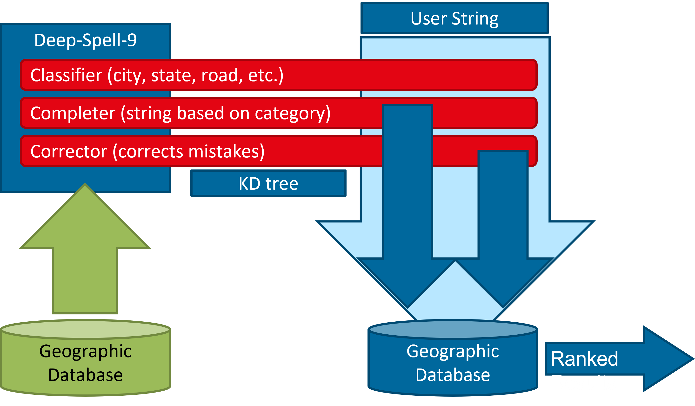

Deep-Spell-9
============

## About

Deep-Spell-9 enables neural auto-completion and matching of geographic queries via deep neural networks.



## Web service

An interactive user interface is provided which allows
you to run Deep-Spell-9 within an interactive browser UI.
Use the `service.json` config file to configure the used models.

You have two options to launch the service:

1. Via a local Python setup: Clone the repo, and run
   
   ```bash
   cd [clone-directory]
   pip install -e .
   # Port defaults to 8091
   ./serve.bash [port]
   ```
   
2. Via Docker:

   ```bash
   docker run --rm -it -p 8091:8091 \
      "ghcr.io/klebert-engineering/ds9:latest" \
      "//ds9/serve.bash"
   ```
   
   **Note:** The default `service.json` in the image does not
   provide an FTS database to match a query to ranked results,
   so you will only be able to see the classifier and completer
   components in action.

After the service is started, open localhost on the
specified port in any browser ([localhost:8091](http://localhost:8091)) by default.
