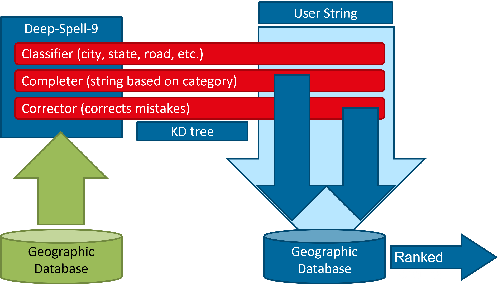

Deep-Spell-9
============

## About

Deep-Spell-9 enables neural auto-completion, classification, spell-correction
and database lookup of geographic queries (roads, cities, states, countries)
via deep neural networks.



As you type a query like `los angeles calif`, DS9

1. **classifies** every character (CITY/STATE/COUNTRY/ROAD) with a BiLSTM tagger,
2. **completes** the query with a class-conditioned character language model
   (beam search; completions never cross a token-class boundary),
3. **corrects** misspelled tokens (SymSpell or a learned embedding space),
4. **looks up** real entries in an SQLite FTS5 database.

## v2 (current)

v2 is a PyTorch rewrite of the original TensorFlow 1.x system. It runs
natively on Linux, macOS (incl. Apple Silicon) and WSL2, trains from a single
SQLite *gazetteer* artifact, and serves a FastAPI app with a browser UI.
Design rationale: [docs/modernization-proposal.md](docs/modernization-proposal.md).

### Install & test

```bash
uv venv .venv --python 3.12 && source .venv/bin/activate
uv pip install torch --index-url https://download.pytorch.org/whl/cpu   # or a CUDA/MPS build
uv pip install -e .[dev]
pytest
```

### Quickstart (toy corpus)

```bash
# 1. data: build a gazetteer from the bundled minimal corpus
ds9 data import-legacy-tsv corpora/deepspell_minimal.tsv /tmp/minimal.sqlite

# 2. models: train the tagger and completer (seconds on CPU)
ds9 train tagger    /tmp/minimal.sqlite corpora/grammar-address-na.json /tmp/tagger
ds9 train completer /tmp/minimal.sqlite corpora/grammar-address-na.json /tmp/completer

# 3. play
ds9 demo /tmp/tagger.json /tmp/completer.json
```

For real models, import the full North-America TSV corpus (9.5 M tokens) or
open data — GeoNames is built in (`ds9 data fetch-geonames` /
`import-geonames`), an OSM road importer is planned:

```bash
ds9 data import-legacy-tsv corpora/deepspell_data_north_america_nozip_v2.tsv corpora/na-v2.sqlite
```

Training commands, recommended hyperparameters and expected metrics:
[docs/v2-training-runbook.md](docs/v2-training-runbook.md).

### Web service

```bash
ds9 data build-lookup   corpora/na-v2.sqlite corpora/na-v2-lookup.sqlite
ds9 data build-symspell corpora/na-v2.sqlite corpora/na-v2-symspell.txt
ds9 serve configs/service-v2.example.json    # http://localhost:8091
```

The service also queries licensed NDS `RoadFTS5_*` databases directly (stock
sqlite3 reads them — see `configs/service-v2-nds.example.json`).

Docker (CPU inference):

```bash
docker buildx build -f docker/Dockerfile -t ds9:2.0 .
docker run --rm -p 8091:8091 -v $PWD/artifacts:/data ds9:2.0 ds9 serve /data/service.json
```

## Legacy v1 (TensorFlow 1.9)

The original implementation lives in `modules/` with its entry scripts at the
repo root (`train-*.py`, `eval-*.py`, `predict.py`, `service.py`). It
requires Python 3.6 / TensorFlow 1.9 and is kept for reference; the published
image still runs the legacy demo:

```bash
docker run --rm -it -p 8091:8091 \
   "ghcr.io/klebert-engineering/ds9:2023.1" \
   "//ds9/serve.bash"
```

With a licensed NDS FTS database under `corpora/`:

```bash
docker run --rm -it -p 8091:8091 \
   -v $PWD/corpora://ds9/corpora \
   --env SERVICE_CONFIG="corpora/service-with-fts5.json" \
   "ghcr.io/klebert-engineering/ds9:2023.1" \
   "//ds9/serve.bash"
```
